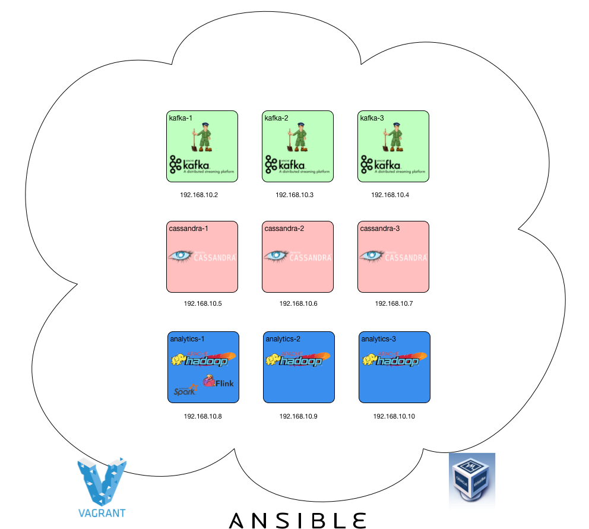

#Fast Data Cluster

## Content

In case you need a local cluster providing Kafka, Cassandra and Spark you're at the right place.

* [Apache Kafka 0.10.2.0](http://kafka.apache.org/0102/documentation.html)
* [Apache Spark 2.1.0](http://spark.apache.org/releases/spark-release-2-1-0.html)
* [Apache Cassandra 3.10](http://cassandra.apache.org)
* [Apache Hadoop 2.8.0](https://hadoop.apache.org/docs/r2.8.0/)
* [Apache Flink 1.2.0](https://ci.apache.org/projects/flink/flink-docs-release-1.2)

## Prerequisites

* [Vagrant](https://www.vagrantup.com) (tested with 1.9.1)
* [VirtualBox](http://virtualbox.org) (tested with 5.1.14)
* The vms take approx 18 GB of RAM, so you should have more than that.


## Init

```bash
git clone https://github.com/markush81/fastdata-cluster.git
vagrant up
```

## Cluster

The result if everything wents fine should be




## Coordinates

#### Servers

| IP | Hostname | Description | Settings |
|:--- |:-- |:-- |:-- |
|192.168.10.2|zookeeper-1|running a zookeeper instance| 512 MB RAM |
|192.168.10.3|zookeeper-2|running a zookeeper instance| 512 MB RAM |
|192.168.10.4|zookeeper-3|running a zookeeper instance| 512 MB RAM |
|192.168.10.5|kafka-1|running a kafka broker| 1024 MB RAM |
|192.168.10.6|kafka-2|running a kafka broker| 1024 MB RAM |
|192.168.10.7|kafka-3|running a kafka broker| 1024 MB RAM |
|192.168.10.8|cassandra-1|running a cassandra seed node| 1024 MB RAM |
|192.168.10.9|cassandra-2|running a cassandra nodee| 1024 MB RAM |
|192.168.10.10|cassandra-3|running a cassandra seed node| 1024 MB RAM |
|192.168.10.11|analytics-1|running a yarn resourcemanager and nodemanager, hdfs namenode, spark distribution, flink distribution| 3584 MB RAM |
|192.168.10.12|analytics-2|running a yarn nodemanager, hdfs datanode | 3072 MB RAM |
|192.168.10.13|analytics-3|running a yarn nodemanager, hdfs datanode | 3072 MB RAM |

### Connections

| Name |  |
|:-- |:-- |
|Zookeeper|192.168.10.2:2181,192.168.10.3:2181,192.168.10.4:2181|
|Kafka Brokers|192.168.10.5:9092,192.168.10.6:9092,192.168.10.7:9092|
|Cassandra Hosts|192.168.10.8,192.168.10.9,192.168.10.10|
|YARN Resource Manager|[http://192.168.10.11:8088](http://192.168.10.11:8088)|
|HDFS Namenode UI|[http://192.168.10.11:50070](http://192.168.10.11:50070)|

(**Note:** most things are not bound to hostname, but IP for the simple reason that you do not need to setup `/etc/hosts` for your host machine)


# Usage


### Connect to Cassandra

```bash
lucky:~ markus$ vagrant ssh cassandra-1
[vagrant@cassandra-1 ~]$ cqlsh
Connected to analytics at 127.0.0.1:9042.
[cqlsh 5.0.1 | Cassandra 3.10 | CQL spec 3.4.4 | Native protocol v4]
Use HELP for help.
cqlsh> 
```

Check Cluster Status:

```bash
[vagrant@cassandra-1 ~]$ nodetool status
Datacenter: dc1
===============
Status=Up/Down
|/ State=Normal/Leaving/Joining/Moving
--  Address        Load       Tokens       Owns (effective)  Host ID                               Rack
UN  192.168.10.8   92.34 KiB  256          69.1%             31f056d4-ffa4-4017-bbec-f07c8be4da3f  rack1
UN  192.168.10.9   89.38 KiB  256          68.9%             f54829f4-3f91-4913-98be-e46129852188  rack1
UN  192.168.10.10  82.36 KiB  256          62.0%             69ba4402-c1d5-450c-9b06-8e96ce3fe92f  rack1
```

## Zookeeper

```bash
lucky:~ markus$ vagrant ssh zookeeper-1
[vagrant@zookeeper-1 ~]$ zookeeper-shell.sh zookeeper-1:2181,zookeeper-3:2181
Connecting to zookeeper-1:2181,zookeeper-3:2181
Welcome to ZooKeeper!
JLine support is disabled

WATCHER::

WatchedEvent state:SyncConnected type:None path:null
ls /
[cluster, controller, controller_epoch, brokers, zookeeper, admin, isr_change_notification, consumers, config]

```

## Kafka

### Topic Creation

```bash
lucky:~ markus$ vagrant ssh kafka-1
[vagrant@kafka-1 ~]$ kafka-topics.sh --create --zookeeper zookeeper-1:2181 --replication-factor 2 --partitions 6 --topic sample
Created topic "sample".
[vagrant@kafka-1 ~]$ kafka-topics.sh --zookeeper zookeeper-1 --topic sample --describe
Topic:sample	PartitionCount:6	ReplicationFactor:2	Configs:
	Topic: sample	Partition: 0	Leader: 1	Replicas: 1,2	Isr: 1,2
	Topic: sample	Partition: 1	Leader: 2	Replicas: 2,3	Isr: 2,3
	Topic: sample	Partition: 2	Leader: 3	Replicas: 3,1	Isr: 3,1
	Topic: sample	Partition: 3	Leader: 1	Replicas: 1,3	Isr: 1,3
	Topic: sample	Partition: 4	Leader: 2	Replicas: 2,1	Isr: 2,1
	Topic: sample	Partition: 5	Leader: 3	Replicas: 3,2	Isr: 3,2
[vagrant@kafka-1 ~]$ 
```
### Producer

```bash
[vagrant@kafka-1 ~]$ kafka-console-producer.sh --broker-list kafka-1:9092,kafka-3:9092 --topic sample
[2017-04-22 15:27:41,035] WARN Removing server kafka-1::9092 from bootstrap.servers as DNS resolution failed for kafka-1: (org.apache.kafka.clients.ClientUtils)
Hey, is Kafka up and running?
```

### Consumer

```bash
[vagrant@kafka-1 ~]$ kafka-console-consumer.sh --bootstrap-server kafka-1:9092,kafka-3:9092 --topic sample --from-beginning
Hey, is Kafka up and running?
```

## YARN

The YARN ResourceManager UI can be accessed by [http://192.168.10.11:8088](http://192.168.10.11:8088), from there you can navigate to your application .


**Note:** To fully use the UI you need to add following to your local `/etc/hosts` file, cause the ui mostly translates URLs to the hostnames:

```bash
192.168.10.11 analytics-1
192.168.10.12 analytics-2
192.168.10.13 analytics-3
```

## Spark

### Spark Examples

```bash
lucky:~ markus$ vagrant ssh analytics-1
[vagrant@analytics-1 ~]$ spark-submit --master yarn --class org.apache.spark.examples.SparkPi --deploy-mode cluster --executor-memory 1G --num-executors 3 /opt/spark/examples/jars/spark-examples_2.11-2.1.0.jar 1000
```

### Own Spark Streaming Job

For running your own packages (e.g. from [Spark Playground](https://github.com/markush81/spark-playground/blob/master/doc/StreamingSample.md)), copy them to `./exchange` which is mapped inside to `/vagrant/exchange`:

In order to run this example, prepare Cassandra first

```bash
lucky:fastdata-cluster markus$ vagrant ssh cassandra-1
[vagrant@cassandra-1 ~]$ cqlsh
Connected to analytics at 127.0.0.1:9042.
[cqlsh 5.0.1 | Cassandra 3.10 | CQL spec 3.4.4 | Native protocol v4]
Use HELP for help.
cqlsh> CREATE KEYSPACE sample WITH REPLICATION = { 'class' : 'NetworkTopologyStrategy', 'dc1' : 2  };
cqlsh> CREATE TABLE sample.wordcount (
   ...     time timestamp,
   ...     count bigint,
   ...     PRIMARY KEY (time));
```

Next submit the application to YARN:

```bash
spark-submit --master yarn --class org.mh.playground.spark.StreamingSample --conf spark.yarn.submit.waitAppCompletion=false --deploy-mode cluster --executor-memory 1G --num-executors 3 /vagrant/exchange/spark-playground-all.jar
```

Produce records into Kafka:

```bash
lucky:fastdata-cluster markus$ vagrant ssh kafka-1
[vagrant@kafka-1 ~]$ kafka-producer-perf-test.sh --producer-props bootstrap.servers="kafka-1:9092,kafka-2:9092,kafka-3:9092" --topic sample --num-records 2000 --throughput 100 --record-size 256

```

Finally should look similar to this:


## Flink

### Flink Examples

You can find Flink Web UI via YARN, e.g. [http://analytics-1:8088/proxy/application_1492940607011_0001/#/overview](http://analytics-1:8088/proxy/application_1492940607011_0001/#/overview)

Submit a job:

```bash
[vagrant@analytics-1 ~]$ flink run /opt/flink/examples/streaming/WordCount.jar
```


## Known Issues

### HDFS

Since starting hdfs via systemd is not yet working properly (see also [here](http://hadoop-common.472056.n3.nabble.com/Manual-Installation-CentOS-7-SystemD-Unit-Files-Hadoop-at-boot-td4108321.html#a4108518)), `start-dfs.sh` is executed manually as last step. This means there is no controlled shutdown or startup in case of restart!

Executing `start-dfs.sh` via system leads to `ERROR org.apache.hadoop.hdfs.server.namenode.NameNode: RECEIVED SIGNAL 15: SIGTERM` for namenode as well as datanodes.

### Flink

Since starting flink via system keeps in restarting, it is now manually started `/opt/flink/bin/yarn-session.sh -n 3 -jm 768 -tm 768 -s 2 -d` while provisioning the vm. This means there is no controlled shutdown or startup in case of restart!

## Further Link

- [yarn-default.xml](https://hadoop.apache.org/docs/r2.8.0/hadoop-yarn/hadoop-yarn-common/yarn-default.xml)
- [core-default.xml](https://hadoop.apache.org/docs/r2.8.0/hadoop-project-dist/hadoop-common/core-default.xml)
- [hdfs-default.xml](https://hadoop.apache.org/docs/r2.8.0/hadoop-project-dist/hadoop-hdfs/hdfs-default.xml)

